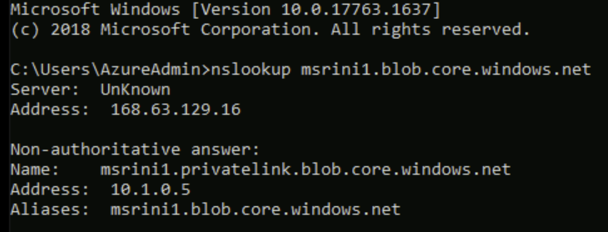

# Troubleshooting Private Link / Private Endpoint DNS Scenarios

## Introduction

This is a troubleshooting guide for Private Link DNS issue. Based on your environment, you can navigete to different scenarios and categories and follow the troubleshooting step to resolve your issue. 

- Scenario 1 - If your Source Machine is deployed in Azure. 
  - Category 1 - If you are using Azure Provided DNS in the Source Virtual Network
  - Category 2 - If you are using a Custom DNS in Source Virtual Network
    - Sub-category 1 - If your Private Endpoint and Custom DNS are part of same Virtual Network 
    - Sub-category 2 - If your Private Endpoint and Custom DNS are part of differnet Virtual Network 
 - Scenario 2 - If your Source Machine is deployed in On-Premises/ other cloud.   
  
## Does your service linked to a Private Endpoint? 
The first step is to check if your Service is configured with Private Endpoint. You can navigate to your respective resource and check if the Private Endpoint is configured and in succeeded state. Also make sure the Private Endpoint connection is approved. 
Once you verified that your Private Endpoint, Private Endpoint connection, Private Endpoint NIC are in succeeded state, now its time to check if your resource is mapped to privatelink FQDN. I have created a private endpoint for a Storage Blob, here is how the CNAME mapping would look like:

**msrini1.blob.core.windows.net.            59 IN	CNAME	msrini1.privatelink.blob.core.windows.net.**

msrini1.privatelink.blob.core.windows.net.  59 IN CNAME blob.yq1prdstr06b.store.core.windows.net.

blob.yq1prdstr06b.store.core.windows.net.   59 IN	A 52.239.190.20

If you are able to see the CNAME record "**privatelink.blob.core.windows.net**" then proceed by choosing your scenario and category below. If you are not seeing this CNAME record, make sure your 1st part resource (Storage in this case) has Private Endpoint configured and in succeeded state. If not, go ahead and raise a Support Ticket. 

You can use [this](https://www.digwebinterface.com/) tool to check whether you have CNAME record for your service FQDN. 

## Scenario 1 : Source Machine deployed in Azure

Based on the type of DNS you use, choose one of the below category:

### Category 1: If you are using Azure Provided DNS in the Source Virtual Network

- RDP or SSH into your Source Virtual Machine and perform nslookup to your service FQDN.

 If everything is configured correctly, then you should be able to get a Private IP of your Private Endpoint as response.In case if you are getting resolved to a Public IP, then that indicates your DNS queries are sent to a Public resolver rather than Private DNS Zone which you have created for your service during the creation of your Private Endpoint. 

